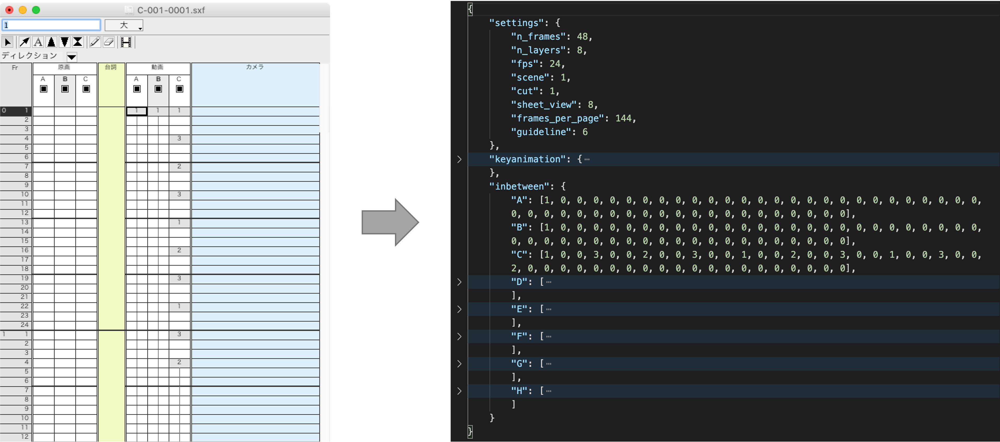
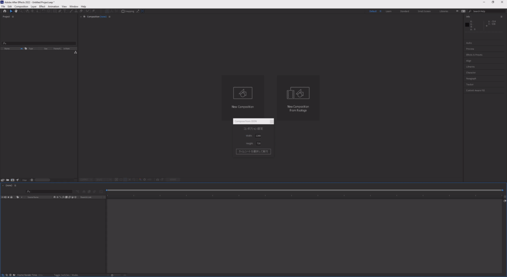

# TimesheetConverter


RETAS STUDIOのタイムシートのsxfファイルをjson形式に変換・保存します．

## 使い方
### Windowsの場合

- GitHubのReleasesから`sxf2json.exe`をダウンロードして好きな場所に置いて下さい．
- sxfファイル，またはsxfファイルの入ったフォルダを`sxf2json.exe`にドラッグ&ドロップしてください．
- sxfファイルと同じ階層にjsonファイルが出力されます．

### Macの場合
- GitHubのReleasesから`sxf2json`をダウンロードして好きな場所に置いて下さい．
- ターミナルで`sxf2json`のあるディレクトリに移動し，以下のコマンドを実行して下さい．
```
sxf2json <タイムシート.sxf>
```

### After Effectsでタイムシートの読み込み


以下のファイルを`Applications/Adobe After Effects <Version>/Scripts`に配置してください．
- `loadTimesheet.jsx`
- `initComp.json`
- `json2.js`[https://gist.github.com/atheken/654510] からダウンロード

1. `File > Scripts > Run Script File...`から`loadTimesheet.jsx`を実行．
2. "タイムシートを選択して実行"ボタンを押す．
3. jsonファイルを選択すると，コンポジションの作成とフッテージの読み込み，タイムリマップの設定が行われます．

`initComp.json`にてコンポジション設定の初期設定を編集することができます．


#### スクリプトからsxfファイルを選択してjson変換を自動で実行
- AfterEffectsにて`Preferences > Scripting & Expressions > Application Scripting > Allow Scripts to Write Files and Access Network`にチェック.
- `sxf2json.exe`(win)または`sxf2json`(mac)をAfterEffectsのScriptsフォルダに配置．
- jsonファイル選択時にsxfファイルを選択すると，バイナリが実行され，json変換・読み込みが行われます．(*パスに日本語が含まれているとうまく行かない可能性があります)